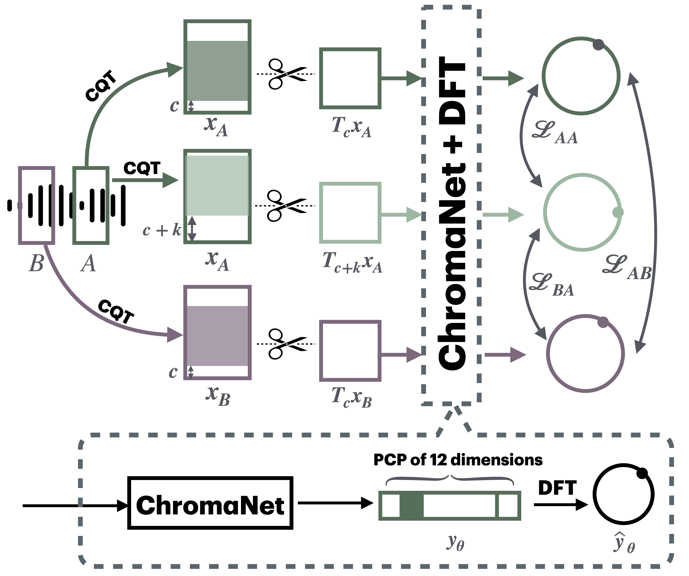
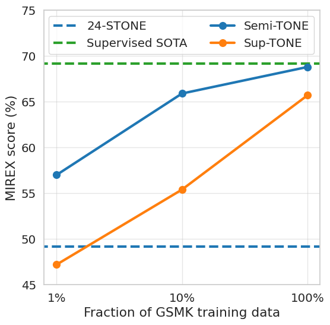

# STONE: Self-supervised Tonality Estimator

This repository contains the checkpoints and the full training and inference code for the two models proposed in [STONE paper](https://arxiv.org/abs/2407.07408), accepted at [ISMIR 2024](https://ismir2024.ismir.net). We name them respectively stone12 and stone24 in the repository. 

It can be easily used for both training and inference.

For clarification:

- **stone12:**  the self-supervised key signature estimator (referred as STONE in the original paper).
- **stone24:** the semi-supervised (can also be trained fully self-supervised and fully supervised) key signature and mode estimator (referred as 24-STONE, semi-TONE, sup-TONE in the original paper).

# Overview

<aside>
💡 **tl;dr STONE is the first self-supervised tonality estimator.**

</aside>

The architecture behind STONE, named `ChromaNet`, is a convnet with octave equivalence which outputs a key signature profile (KSP) of 12 structured logits.
We train ChromaNet to regress artificial pitch transpositions between any two unlabeled musical excerpts from the same audio track.



Overview of our proposed STONE architecture.

We extract two segments from the same audio track, and crop them in the way so that we create one pair of segments in the same key and another pair in different keys. Then we pass the CQTs into ChromaNet and obtain the KSPs. 

We calculate the Discrete Fourier Transform (DFT), which can be seen as a projection into the circle of fifths (or semitones). 

A illustration of the Equation 2 (the DFT) in the original paper is shown as below:


The losses are then bases on the distance of these projections on the circle of fifths (or semitones), measured as Cross-power spectral density (CPSD).

The CPSD is defined as:

```math
\widehat{\boldsymbol{R}}_{\boldsymbol{y}_{\boldsymbol{\theta},{\mathrm{A}}},\boldsymbol{y}_{\boldsymbol{\theta},{\mathrm{B}}}}[\omega] = \mathcal{F}\{\boldsymbol{R}_{\boldsymbol{y}_{\boldsymbol{\theta},{\mathrm{A}}},\boldsymbol{y}_{\boldsymbol{\theta},{\mathrm{B}}}}\}[\omega] = \widehat{\boldsymbol{y}}_{\boldsymbol{\theta},{\mathrm{A}}}[\omega]\widehat{\boldsymbol{y}}_{\boldsymbol{\theta},{\mathrm{B}}}^{\ast}[\omega]
```

where $`\boldsymbol{R}_{\boldsymbol{y}_{\boldsymbol{\theta},{\mathrm{A}}},\boldsymbol{y}_{\boldsymbol{\theta},{\mathrm{B}}}}[k] =
\sum_{q=0}^{Q-1} \boldsymbol{y}_{\boldsymbol{\theta},{\mathrm{A}}}[q] \boldsymbol{y}_{\boldsymbol{\theta},{\mathrm{B}}}[(q+k)\,\textrm{mod}\,Q]`$. 

Intuitively, in the case where  $`\widehat{\boldsymbol{y}}_{\boldsymbol{\theta},{\mathrm{A}}}[\omega]`$  *and*  $`\widehat{\boldsymbol{y}}_{\boldsymbol{\theta},{\mathrm{B}}}[\omega]`$ are both one hot-encoding of 12 dimensions, they will be mapped as complex numbers of module 1 on the border of the CoF. 

$`\widehat{\boldsymbol{R}}{ \boldsymbol{y}_{\boldsymbol{\theta},\mathrm{A}},\boldsymbol{y}_{\boldsymbol{\theta},\mathrm{B}}}[\omega]`$ measures the difference of phases on the CoF. 

The equation for loss calculation is defined as:

```math
\mathcal{D}_{\boldsymbol{\theta},k}(\boldsymbol{x}_{\mathrm{A}}, \boldsymbol{x}_{\mathrm{B}}) = \dfrac{1}{2} \big \vert
e^{- 2\pi\mathrm{i}\omega k/Q} - \widehat{\boldsymbol{R}}_{ \boldsymbol{y}_{\boldsymbol{\theta},\mathrm{A}},\boldsymbol{y}_{\boldsymbol{\theta},\mathrm{B}}}[\omega] \big \vert^2
```

Continuing the intuitive case above, $`\mathcal{D}_{\boldsymbol{\theta},k}(\boldsymbol{x}_{\mathrm{A}}, \boldsymbol{x}_{\mathrm{B}})`$ measures its deviation from the DFT basis vector $e^{- 2\pi\mathrm{i}\omega k/Q}$, which corresponds to the actual pitch shift k on the CoF.

The same formula is applied to different segment combinations, with or without pitch transpositions in between.

Please refer to the original paper for more detailed explanation.

We evaluate these estimators on [FMAKv2](https://zenodo.org/records/12759100), a new dataset of 5489 real-world musical recordings with expert annotation of 24 major and minor keys.

We observe that this self-supervised pretext task leads KSP to correlate with tonal key signature.

| **Model** | **Correct** | **Fifth** | **KSEA** |
| --- | --- | --- | --- |
| Feature engineering | 1599 | 981 | 38% |
| STONE (w=7) | 3587 | 1225 | 77% |
| **STONE** (w=1) | **3883** | 920 | **79%** |
| Supervised SOTA [Korzeniowski 2018] | 4090 | 741 | 81% |

Based on this observation, we extend STONE to output a structured KSP of 24 logits, and introduce supervision so as to disambiguate major versus minor keys sharing the same key signature.

Applying different amounts of supervision yields semi-supervised and fully supervised tonality estimators: i.e., Semi-TONEs and Sup-TONEs.



Evaluation of self-supervised (dashed blue), semi-supervised (solid blue), and supervised models (orange) on FMAK. All models use $\omega=7$. We also report the supervised state of the art (SOTA).

We find that Semi-TONE matches the classification accuracy of Sup-TONE with reduced supervision and outperforms it with equal supervision.

The confusion matrix of Semi-TONE and STONE (for key signature prediction):


Confusion matrices of STONE (left, 12 classes) and Semi-TONE (right, 24 classes) on FMAK, both using w=7. The axis correspond to model prediction and reference respectively, keys arranged by proximity in the CoF and relative modes. Deeper colors indicate more frequent occurences per relative occurence per reference key.

# Setup

 `Python 3.10` is used for this project. `Poetry` is used to manage packages. We also provide a Dockerfile for users to run the program inside of a docker container. 

```
git clone https://github.com/deezer/stone
cd stone
docker build . -t <image-name>:<tag> 
docker run -ti --gpus all -v ./:/workspace/ --entrypoint bash <image-name>
poetry run python <script>
```

# Training

## Example usage

`poetry run python -m main -n basic -tt ks -g config/ks.gin`

## Command-line arguments

- `-n` `—-exp-name`, the name of the experiment. If the experience name was used before and
- `-tt` `--train-type` , type of training: `ks` (key signature) for stone12, `ks_mode` for stone24.
- `-c` `--circle-type` , the circle where key signature profile is projected. 1 or 7.
- `-s` `--save-dir`, the path where the checkpoint and tensorboard logs will be saved.
- `-e` `--n-epochs` , number of epochs.
- `-ts` `-train-steps` , steps of training per epoch.
- `-vs` `--val-steps` , steps of validation per epoch.
- `-g` `--gin-file` , path to configuration file for training. There are two gin files saved in `/config` , users can modify them to their own purpose.

## Dataloader

The dataloader provides waveform data for the model. 

We don’t provide the exact code for dataloader, however we provide the shape and the property of training data needed. 

<aside>
💡 **NOTE**: like the `Class Toydataset` provided in the code, your dataloader should be able to provide infinite amount of training data to be able to fit the training code. This can be achieved by using `ds.repeat()` if you use `tensorflow` for loading and processing audios, or `IterableDataset` if you use `pytorch`.

</aside>

1. **Data shape for `stone12` :** the data shape of each batch should be (batch_size, duration*sampling_rate, 2). “2” corresponds the number of segments needed from each track. They are assumed to have the same key.
2. **Data shape for `stone24` :** there are three modes for the dataloader: “supervised”, “selfsupervised” or “mixed”. In all cases, the data of each batch should be a dictionary which contains two items: *audio* and *keymode.*
    1. **selfsupervised**: the data shape of *audio* should be (batch_size, duration*sampling_rate, 2), just like for `stone12` . *keymode* should be a tuple of a list as `([”-1” * batch_size])`. This is the dataloader used for the 24-STONE model in the original paper.
    2. **supervised:** the data shape of *audio* should be (batch_size, duration*sampling_rate, 1), since we do NOT need  a second segment from the audio. *keymode* should be a tuple of a list that contains the labels for corresponding audios, such as `([”A minor”, “C Major”, “Bb minor”, …])`. This is the dataloader used for all the Sup-TONE models in the original paper.
    3. **mixed:** the dataloader alternates between a and b. This is the dataloader used for all Semi-TONE models in the original paper.

<aside>
💡

NOTE: the audio should be normalised to a value range of [0, 1]. The sampling rate we use is `22050Hz`, and the segment length is `15s`, as provided in gin files under `/config` . However you can modify these values easily in the gin files.

</aside>

## Device

Users need to specify the device for training in `training_loop.py` .

## Configuration

We use gin file to configure parameters for audio and architecture, more information of usage at [gin-config](https://github.com/google/gin-config). 

## Results

Models with checkpoints are saved at `./<save_dir>/models/<train_type>/<circle_type>/<name>/` where `save_dir` is passed with the tag `-s` and `name` is passed with the tag `-c` ; Tensorboard information is saved at `./<save_dir>/tensorboard/<train_type>/<circle_type>/<name>/`

# Inference

## Example usage

`poetry run python -m inference /checkpoint/path /audio/path -e mp3 -tt ks`

checkpoint path is the path where checkpoint is saved: we provided two checkpoints under `/ckpt`. `semisupervised_key_mode.pt` is for both key signature and mode estimation. `semitone_ks.pt` is for key signature estimation.

audio path is the the path to the folder where audios are saved.

The command will generate a `/results/ckpt_name/results.npz` file with results saved in the same directory as audios. You can load and analyse the `.npz` file by using `np.load()`. You can also change the saving directory in `inference.py` .

## Command-line arguments

- `-e` `--extension` , audio format.
- `-o` `--overlap` , set to `False` by default. The percentage of overlap between adjacent window.
- `-a` `--average` , set to `True` by default. If the result is averaged throughout the audio track.
- `-tt` `--train-type` , type of training: `ks` (key signature) for stone12, `ks_mode` for stone24.

## Mapping

The mappings to transform model output (integers) to key signature and mode classes (text) is as following:

```python
# for 12stone (semitone_ks.pt)
map_ks = {0: 'Bb Major/G minor', 1: 'B Major/G# minor', 2: 'C Major/A minor', 3: 'C# Major/Bb minor', 4: 'D Major/B minor', 5: 'D# Major/C minor', 6: 'E Major/C# minor', 7: 'F Major/D minor', 8: 'F# Major/D# minor', 9: 'G Major/E minor', 10: 'G# Major/F minor', 11: 'A Major/F# minor'}
# for 24stone (semisupervised_key_mode.pt)
map_ks_mode = {0: 'B minor', 1: 'C minor', 2: 'C# minor', 3: 'D minor', 4: 'D# minor', 5: 'E minor', 6: 'F minor', 7: 'F# minor', 8: 'G minor', 9: 'G# minor', 10: 'A minor', 11: 'Bb minor', 12: 'D Major', 13: 'D# Major', 14: 'E Major', 15: 'F Major', 16: 'F# Major', 17: 'G Major', 18: 'G# Major', 19: 'A Major', 20: 'Bb Major', 21: 'B Major', 22: 'C Major', 23: 'C# Major'}
```

If you train your own models, then the mapping needs to be calculated by using a C major recording provided in the folder `/pitch_fork/Cmajor.mp3` and the output of this input should correspond to the one of C Major.

# Code organisation
stone
├── Dockerfile
├── pyproject.toml
├── README.md
├── init.py
├── figures
│   ├── Cmajor.mp3
├── ckpt
│   ├── semisupervised_ks_mode.pt
│   └── semitone_ks.pt
├── config
│   ├── ks.gin
│   └── ks_mode.gin
├── src
│   ├── hcqt.py
│   ├── stone12
│   │   ├── init.py
│   │   ├── dataloader
│   │   │   └── init.py
│   │   ├── model
│   │   │   ├── chromanet.py
│   │   │   └── convnext.py
│   │   ├── stone.py
│   │   └── stone_loss.py
│   ├── stone24
│   │   ├── init.py
│   │   ├── dataloader
│   │   │   └── init.py
│   │   ├── model
│   │   │   ├── chromanet.py
│   │   │   └── convnext.py
│   │   ├── stone.py
│   │   └── stone_loss.py
│   └── utils
│       ├── callbacks.py
│       ├── gin.py
│       ├── scheduler.py
│       └── training.py
├── inference.py
├── main.py
└── training_loop.py

# Cite

If you use this work, please cite:

```latex
@article{kong2024stone,
  title={STONE: Self-supervised Tonality Estimator},
  author={Kong, Yuexuan and Lostanlen, Vincent and Meseguer-Brocal, Gabriel and Wong, Stella and Lagrange, Mathieu and Hennequin, Romain},
  journal={International Society for Music Information Retrieval Conference (ISMIR 2024)},
  year={2024}
}
```
